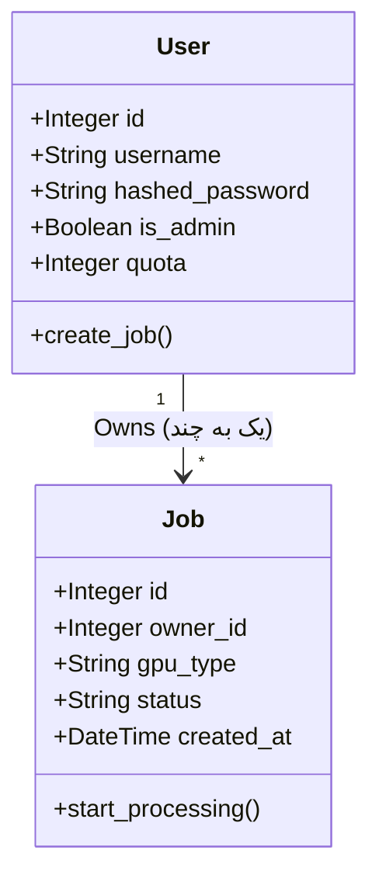

# مستندات معماری سیستم GPU as a Service

## 🏗 نمای کلی معماری
این پروژه بر اساس معماری **Client-Server** و الگوی **RESTful API** طراحی شده است.

### اجزای سیستم
1.  **Frontend:** رابط کاربری (UI) که با HTML/JS و موتور قالب‌ساز Jinja2 پیاده‌سازی شده است.
2.  **Backend:** فریم‌ورک FastAPI که وظیفه مدیریت درخواست‌ها، احراز هویت و منطق تجاری را بر عهده دارد.
3.  **Database:** پایگاه داده رابطه ای (SQLite) که با استفاده از SQLAlchemy ORM مدیریت می‌شود.
4.  **Auth System:** سیستم احراز هویت Stateless با استفاده از توکن‌های JWT.

---

## 📊 نمودار کلاس‌ها (UML Class Diagram)
در نمودار زیر، ساختار دیتابیس و ارتباط بین کاربر (`User`) و درخواست‌ها (`Job`) نمایش داده شده است:

🧩 تشریح مدل‌های داده

کلاس User (کاربران)
وظیفه: نگهداری اطلاعات هویتی و سهمیه‌ها.

. Attributes:

   . id: شناسه یکتا

   . username: نام کاربری

   . hashed_password: رمز عبور (Hash شده با bcrypt)

   . is_admin: تعیین نقش مدیر/کاربر

   . quota: میزان اعتبار باقی‌مانده (ثانیه)

کلاس Job (درخواست‌ها)
وظیفه: نگهداری اطلاعات پردازش‌های درخواستی.

 . Attributes:

   . id: شناسه درخواست

   . owner_id: ارتباط با کاربر درخواست‌دهنده (Foreign Key)

   . gpu_type: نوع منبع (T4, V100, A100)

   . status: وضعیت فعلی (PENDING, APPROVED, RUNNING, COMPLETED, FAILED)

   . created_at: زمان ثبت درخواست

🔄 چرخه حیات درخواست (Job Lifecycle)
1. PENDING: کاربر درخواست را ثبت می‌کند.

2. APPROVED: مدیر سیستم درخواست را تایید می‌کند.

3. RUNNING: سیستم (Worker شبیه‌سازی شده) پردازش را شروع می‌کند.

4. COMPLETED: پس از اتمام زمان پردازش، وضعیت نهایی می‌شود.